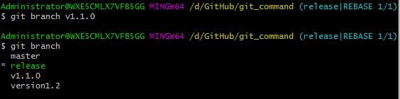
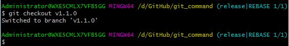
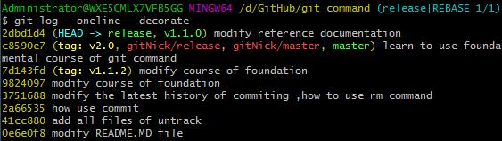
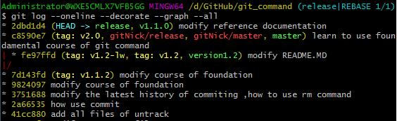
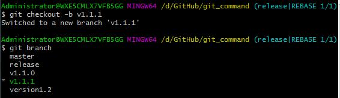
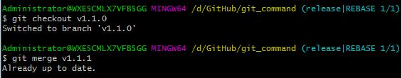
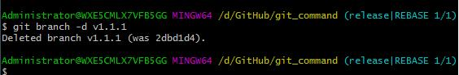
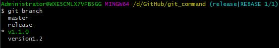
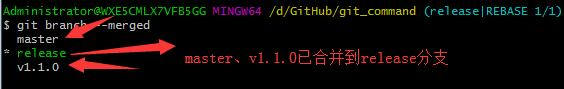
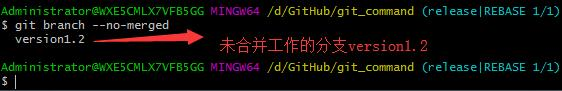

- Git 分支

|实例|说明|
|----|---|
|`git branch v1.1.0`  |创建新分支`v1.1.0`
|`git checkout v1.1.0`  |切换分支`v1.1.0`
|`git log --oneline --decorate`  |查看HEAD的指向情况
|`git log --oneline --decorate --graph --all`  |查看提交历史、各个分支的指向以及项目的分叉情况
|`git checkout -b v1.1.1`  |创建新分支`v1.1.1`，并切换到该分支  等同于执行`git branch v1.1.1`和`git checkout v1.1.1`
|`git merge v1.1.1`  |切换到分支`v1.1.0`，并将`v1.1.1`分支合并到当前分支  合并分支的时候，在不同分支上对同一份文件进行修改，会出现合并冲突，执行该命令时提示`Automatic merge failed`，手动打开冲突的文件并删除多余的分支版本，然后执行`git add <files>`和`git commit`操作
|`git branch -d v1.1.1`  |删除分支`v1.1.1`，删除之前调用`git branch`查看分支情况
|`git branch`  |查看当前所有分支，并以列表形式展示
|`git branch --merged`  |可以肯定没有`*`的分支已合并到当前分支，可以执行`git branch -d`删除掉
|`git branch --no-merged`  |查看所有包含未合并工作的分支，尝试执行`git branch -d`删除命令会失败  *Note that：*除非使用了`-D`强制删除选项，并丢失掉该分支修改的操作

## 参考资料 ##

> [3.1 Git 分支 - 分支简介](https://git-scm.com/book/zh/v2/Git-%E5%88%86%E6%94%AF-%E5%88%86%E6%94%AF%E7%AE%80%E4%BB%8B)

> [3.2 Git 分支 - 分支的新建与合并](https://git-scm.com/book/zh/v2/Git-%E5%88%86%E6%94%AF-%E5%88%86%E6%94%AF%E7%9A%84%E6%96%B0%E5%BB%BA%E4%B8%8E%E5%90%88%E5%B9%B6)

> [3.3 Git 分支 - 分支管理](https://git-scm.com/book/zh/v2/Git-%E5%88%86%E6%94%AF-%E5%88%86%E6%94%AF%E7%AE%A1%E7%90%86)

> [3.4 Git 分支 - 分支开发工作流](https://git-scm.com/book/zh/v2/Git-%E5%88%86%E6%94%AF-%E5%88%86%E6%94%AF%E5%BC%80%E5%8F%91%E5%B7%A5%E4%BD%9C%E6%B5%81)

