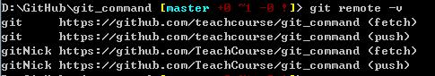
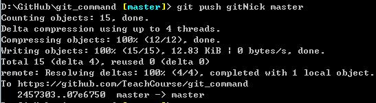

- 检查当前目录文件状态

```
git status
```

- 添加未跟踪的文件或文件夹

```
//单个文件添加
git add README.MD

//批量文件添加
git commit -a -m 'add more files'
```

- 提交暂存起来的文件

```
git commit
```

- 删除某个文件

```
git rm note.txt
```

- 状态简略

```
git status -ss
```

- 查看已暂存的文件

```
//--staged 和 --cached是同义词
git diff --cached
```

- 查看未暂存的文件

```
git diff
```

[2.2 Git 基础 - 记录每次更新到仓库](https://git-scm.com/book/zh/v2/Git-%E5%9F%BA%E7%A1%80-%E8%AE%B0%E5%BD%95%E6%AF%8F%E6%AC%A1%E6%9B%B4%E6%96%B0%E5%88%B0%E4%BB%93%E5%BA%93)


- 检查提交的日志

```
git log

//比较最近2次提交日志的区别
git log -p -2

//查看提交日志的统计信息
git log --stat
```
[2.3 Git 基础 - 查看提交历史](https://git-scm.com/book/zh/v2/Git-%E5%9F%BA%E7%A1%80-%E6%9F%A5%E7%9C%8B%E6%8F%90%E4%BA%A4%E5%8E%86%E5%8F%B2)


- 撤销提交操作

```
git commit --amend

//添加新的文件后覆盖最新提交的版本
git commit -m 'initial commit'
git add forgotten_file
git commit --amend
```

- 取消暂存的文件

```
git reset HEAD <file>...
```

- 保持本地文件和仓库一致

```
//双减号后空格，后面文件名
git checkout -- README.MD
//保持分支一致
git checkout master
```
[2.4 Git 基础 - 撤消操作](https://git-scm.com/book/zh/v2/Git-%E5%9F%BA%E7%A1%80-%E6%92%A4%E6%B6%88%E6%93%8D%E4%BD%9C)


- 查看远程仓库

```
git remote -v
```




- 添加远程仓库

```
//pb表示别名，可以代替完整的url地址
git remote add pb https://github.com/teachcourse/git_command
```

- 拉取远程仓库

```
//用别名pb代替完整的url地址：https://github.com/teachcourse/git_command
git fetch pb

git fetch https://github.com/teachcourse/git_command
```

- 推送到远程仓库

```
//推送成功演示
git push https://github.com/teachcourse/git_command

//pb表示仓库别名（推送失败）
git push pb
```




- 查看远程仓库

```
//origin表示仓库url别名，比如：gitNick
git remote show origin
<<<<<<< HEAD
```

- 远程仓库的重命名

```
//gitNick为原仓库名字，origin为新仓库名字
git remote rename gitNick origin
```

- 远程仓库的删除

```
git remote rm origin
```
[2.5 Git 基础 - 远程仓库的使用](https://git-scm.com/book/zh/v2/Git-%E5%9F%BA%E7%A1%80-%E8%BF%9C%E7%A8%8B%E4%BB%93%E5%BA%93%E7%9A%84%E4%BD%BF%E7%94%A8)


- 列出所有标签

```
git tag

//列出符合条件的标签
git tag -l 'v1.8.*'
```

- 创建附注标签（annotated）

```
//-m 后面添加描述的信息
git tag -a v1.4 -m 'add description infomation'
```

- 查询标签对应信息

```
git show v1.4
```

- 创建轻量标签

```
//v1.4-lw为轻量标签的名称
git tag v1.4-lw
```

[2.6 Git 基础 - 打标签](https://git-scm.com/book/zh/v2/Git-%E5%9F%BA%E7%A1%80-%E6%89%93%E6%A0%87%E7%AD%BE)


- Git全局别名

```
//使用co代替完整的checkout
git config --global alias.co checkout

git config --global alias.br branch

git config --global alias.ci commit

//对于长的字符串，体现别名的好处
git config --global alias.unstage 'reset HEAD --'

git config --global alias.last 'log -l HEAD'
```

[2.7 Git 基础 - Git 别名](https://git-scm.com/book/zh/v2/Git-%E5%9F%BA%E7%A1%80-Git-%E5%88%AB%E5%90%8D)


- 新建分支

```
git branch iss53
```

- 切换分支

```
git checkout iss53
```

- 新建并切换分支

```
//创建分支iss53，并切换到该分支
git checkout -b iss53
```

- 合并分支

```
git merge iss53
```


- 
=======
```

- 远程仓库的重命名

```
//gitNick为原仓库名字，origin为新仓库名字
git remote rename gitNick origin
```

- 远程仓库的删除

```
git remote rm origin
```
>>>>>>> 07e6750205df2c51e145d3dc386065fa94683474
