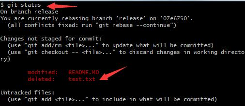
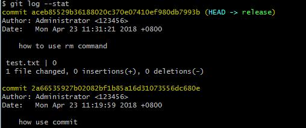
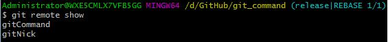

本文以`git_command`仓库为例子，演示git命令行的实际用法

- Git 基础

|实例|说明|
|----|---|
|`git init`  |进入项目根目录，初始化项目添加.git脚本
|`git status`  |检查当前目录文件状态
|`git add README.MD`  |添加需要跟踪的文件
|`git commit`  |提交添加跟踪的文件，并手动输入描述文字（注意：）
|`git commit -m 'modify README.MD file'`  |提交添加跟踪的文件
|`git commit -a -m 'add all files of untrack'`  |批量添加需要跟踪的文件，并提交
|`git clone https://github.com/TeachCourse/git_command.git`|将git_command仓库内容克隆到本地
|`git clone https://github.com/TeachCourse/git_command.git GitRepertory`|将git_command仓库内容克隆到本地，并重命名本地仓库名字为GitRepertory
|`git status -s`  |以紧凑格式，输出当前目录文件状态  *Note that*：  MM：第一个M表示文件被修改，没有添加到暂存区；第二个M表示文件被修改，并添加到暂存区  ??：表示新添加的为跟踪的文件  A：表示新添加到暂存区的文件
|`cat .gitignore`  |命令行打印指定文件.gitignore内容
|`git diff`  |比较未暂存文件前后变化的地方（注意：按下Q退出）
|`git diff --cached`  |比较已暂存文件前后变化的地方
|`rm test.txt`  |从本地仓库目录中删除test.txt文件
|`git rm test.txt`  |从已跟踪文件清单中删除test.txt文件
|`git rm -f test.txt`|从暂存区域中删除test.txt文件
|`git rm --cached test.txt`|从仓库中删除test.txt文件
|`git rm log/\*.log`|从暂存区中删除log目录下使用.log后缀的文件
|`git rm \*~`|从暂存区中删除所有以`~`结尾的所有文件
|`git mv test.txt test.md`|将暂存区`test.txt`文件重命名为`test.md`
|`mv test.txt test.md`  |将本地仓库`test.txt`文件重命名为`test.md`
|`git log`  |查看提交历史记录  `-(n)`，仅显示最近的n条提交历史记录  `--since,--after`，仅显示指定时间之后的提交  `--until,--before`，仅显示指定时间之前的提交  `--author`，仅显示指定作者相关的提交  `--committer`，仅显示指定提交者相关的提交  `--grep`，仅显示包含指定关键字的提交  `-S`，仅显示添加或删除了某个关键字的提交
|`git log -p -2`  |查看最近两次提交历史差异  -p，按补丁格式显示每个更新之间的差异  --stat，显示每次更新的文件修改统计信息  --shortstat，只显示`--stat`中最后的行数修改添加删除统计  --name-only，仅在提交信息后显示已修改的文件清单  --name-status，显示新增、修改、删除的文件清单  --abbrev-commit，仅显示SHA-1的前几个字符，而非所有的40个字符  `--relative-date`，使用较短的相对时间显示（比如："2 weeks ago"）  `--graph`，显示ASCII图形表示的分支合并历史  `--pretty`，使用其他格式显示历史提交信息。可用的选项包括oneline，short，full，fuller和format(后跟指定格式)
|`git log --stat`  |查看提交历史记录的简略版
|`git log --pretty=oneline`  |查看提交历史记录的不同展示方式
|`git log --pretty=format:"%h-%an,%ar:%s"`  |自定义查看提交历史记录的展示方式  %H，提交对象的完整哈希字符串  %h，提交对象的简短哈希字串  %T，树对象的完整哈希字串  %t，树对象的简短哈希字串  %P，父对象的完整哈希字串  %p，父对象的简短哈希字串  %an，作者的名字  %ae，作者的电子邮件地址  %ad，作者修订日期（可以用`--date=`选项定制格式）  %ar，作者修订日期，按多久以前的方式显示  %cn，提交者的名字  %ce，提交者的电子邮件地址  %cd，提交日期  %cr，提交日期，按多久以前的方式显示  %s，提交说明
|`git log --pretty=format:"%an-%h %s" --graph`  |形象地展示分支、合并历史
|`git log --since=2.weeks`  |列出最近两周内的提交历史记录
|`git log --grep add`  |列出提交说明中包含关键字`add`的提交历史记录
|`git log --author 钊林`  |列出作者：*钊林*的提交历史记录
|`git log --since="2018-4-10"`|列出从指定时间以来的提交历史记录
|`git commit --amend`  |修改最新一次提交历史记录（包括添加新跟踪的文件、修改文件、删除文件），先执行`git add`或`git rm`操作后，再执行该方法
|`git reset HEAD README.MD`  |取消添加到暂存区内指定文件
|`git checkout -- README.md`  |使用远端仓库的`README.md`文件**覆盖**本地仓库已修改的文件（谨慎操作）
|`git remote`  |查看远端仓库简写的名称或者别名
|`git remote -v`  |查看远端仓库别名和其对应的URL地址
|`git remote add gitCommand https://github.com/TeachCourse/git_command.git`  |添加远端仓库别名和其对应的URL地址
|`git fetch gitCommand`|拉取远端仓库`gitCommand`对应内容到本地仓库，但没有合并（merge），需要手动merge
|`git push gitNick release`  |将本地仓库内容推送到远端仓库的release分支
|`git pull gitNick release`  |拉取远端仓库`gitNick`对应内容到本地仓库，并自动合并（merge），**区别fetch**
|`git remote show gitNick`  |查看远端仓库的更多信息
|`git remote show`  |查看远端仓库的别名信息
|`git remote rename gitCommand gitUrl`  |重命名远端仓库的别名
|`git remote rm gitUrl`  |删除远端仓库别名和其对应的URL地址
|`git tag`  |列出已有的标签信息
|`git tag -l 'v1.*'`|列出符合筛选条件的标签信息
|`git tag -a v1.2 -m 'current version v1.2'`|`-a`表示创建附注标签（annotated）  `-m`表示添加创建标签的说明
|`git show v1.2`  |查看指定标签信息和对应的提交信息
|`git tag v1.2-lw`  |表示创建轻量标签（lightweight），不需要其他参数字段
|`git tag -a v1.1.2 7d143fd9aa`  |给以前提交历史记录，重新添加附注标签`v1.1.2`
|`git push gitNick v1.1`  |推送标签`v1.1`到远端仓库
|`git push gitNick --tags`  |一次性推送所有标签到远端仓库，包括：`v1.1.2`、`v1.2`、`v1.2-lw`
|`git checkout -b version1.2 v1.2`  |创建新的分支`version1.2`，并将标签`v1.2`版本更新下来（checkout）
|`git config --global alias.co checkout`|设置`checkout`别名为`co`，简化用法：`git co release`，表示切换到release分支
|`git config --global alias.br branch`|设置`branch`别名为`br`，简化用法：`git br`，表示查看分支情况
|`git config --global alias.ci commit`|设置`commit`别名为`ci`，简化用法：`git ci`，表示提交记录
|`git config --global alias.st status`|设置`status`别名为`st`，简化用法：`git st`，表示查看文件状态
|`git config --global alias.unstage 'reset HEAD --'`|设置`reset HEAD --`别名为`unstage`，表示取消暂存区文件
|`git config --global alias.last 'log -1 HEAD'`|设置`log -1 HEAD`别名为`last`，表示查看最新一次提交记录

**参考资料**：

> [获取 Git 仓库](https://git-scm.com/book/zh/v2/Git-%E5%9F%BA%E7%A1%80-%E8%8E%B7%E5%8F%96-Git-%E4%BB%93%E5%BA%93)

> [记录每次更新到仓库](https://git-scm.com/book/zh/v2/Git-%E5%9F%BA%E7%A1%80-%E8%AE%B0%E5%BD%95%E6%AF%8F%E6%AC%A1%E6%9B%B4%E6%96%B0%E5%88%B0%E4%BB%93%E5%BA%93)

> [查看提交历史](https://git-scm.com/book/zh/v2/Git-%E5%9F%BA%E7%A1%80-%E6%9F%A5%E7%9C%8B%E6%8F%90%E4%BA%A4%E5%8E%86%E5%8F%B2)

> [撤消操作](https://git-scm.com/book/zh/v2/Git-%E5%9F%BA%E7%A1%80-%E6%92%A4%E6%B6%88%E6%93%8D%E4%BD%9C)

> [远程仓库的使用](https://git-scm.com/book/zh/v2/Git-%E5%9F%BA%E7%A1%80-%E8%BF%9C%E7%A8%8B%E4%BB%93%E5%BA%93%E7%9A%84%E4%BD%BF%E7%94%A8)

> [打标签](https://git-scm.com/book/zh/v2/Git-%E5%9F%BA%E7%A1%80-%E6%89%93%E6%A0%87%E7%AD%BE)

> [Git 别名](https://git-scm.com/book/zh/v2/Git-%E5%9F%BA%E7%A1%80-Git-%E5%88%AB%E5%90%8D)