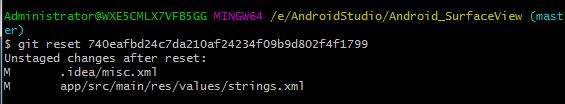

- 项目提交失败


> [github项目提交失败 master -> master (non-fast-forward)](http://michaelye1988.iteye.com/blog/1653599)


- VIM退出命令

> [VIM中的保存和退出、VIM退出命令、如何退出vim编辑、VIM命令大全](https://blog.csdn.net/feosun/article/details/73196299)


- git fetch：相当于是从远程获取最新版本到本地，不会自动merge

```
Git fetch origin master
git log -p master..origin/master
git merge origin/master
```

以上命令的含义： 
首先从远程的origin的master主分支下载最新的版本到origin/master分支上；然后比较本地的master分支和origin/master分支的差别；最后进行合并。上述过程其实可以用以下更清晰的方式来进行：

```
git fetch origin master:tmp
git diff tmp 
git merge tmp
```

从远程获取最新的版本到本地的tmp分支上之后再进行比较合并 

- git pull：相当于是从远程获取最新版本并merge到本地

```
git pull origin master
```

上述命令其实相当于git fetch 和 git merge 在实际使用中，git fetch更安全一些。因为在merge前，我们可以查看更新情况，然后再决定是否合并结束。

- checkout：切换分支（删除、添加或更改项目内的文件）

```
git checkout release
```

上述命令的含义：

将当前分支切换到release


- rebase命令和merge命令的区别

```
//rebase操作：
git rebase origin

//merge操作：将origin合并到本地当前分支
git merge origin
```

> [git merge 和 git rebase 小结](https://blog.csdn.net/wh_19910525/article/details/7554489)


- Git如何取消本地commit操作

|command|description|
|-------|-----------|
|`git reset --mixed`|此为默认方式，不带任何参数的git reset，即时这种方式，它回退到某个版本，只保留源码，回退commit和index信息
|`git reset --soft`|回退到某个版本，只回退了commit的信息，不会恢复到index file一级。如果还要提交，直接commit即可
|`git reset –hard`|彻底回退到某个版本，本地的源码也会变为上一个版本的内容
|`HEAD`|最近一个提交
|`HEAD^`| 上一次

*Note that*:<commit_id>  每次commit的SHA1值. 可以用git log 看到,也可以在页面上commit标签页里找到

```
git reset --hard <commit_id>

git push origin HEAD --force
```

> [撤销修改](https://www.liaoxuefeng.com/wiki/0013739516305929606dd18361248578c67b8067c8c017b000/001374831943254ee90db11b13d4ba9a73b9047f4fb968d000)

> [版本回退](https://www.liaoxuefeng.com/wiki/0013739516305929606dd18361248578c67b8067c8c017b000/0013744142037508cf42e51debf49668810645e02887691000)


- 提示`unstaged changes after reset`

解决的办法如下2中办法：

```
git add .
git reset --hard

//
git stash
git stash drop
```
]



- Git合并多个commit

> [合并多个 Commit](https://www.jianshu.com/p/964de879904a)

> [Git 工具 - 重写历史](https://git-scm.com/book/zh/v1/Git-%E5%B7%A5%E5%85%B7-%E9%87%8D%E5%86%99%E5%8E%86%E5%8F%B2)


- git log命令退出操作

直接按下键盘英文字母：Q


- Git管理SVN代码

> [git-svn：通过git来管理svn代码](https://www.cnblogs.com/h2zZhou/p/6136948.html)

> [Git 与其他系统 - Git 与 Subversion](https://git-scm.com/book/zh/v1/Git-%E4%B8%8E%E5%85%B6%E4%BB%96%E7%B3%BB%E7%BB%9F-Git-%E4%B8%8E-Subversion)