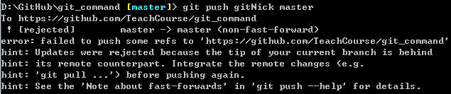

- 项目提交失败

> [github项目提交失败 master -> master (non-fast-forward)](http://michaelye1988.iteye.com/blog/1653599)

- VIM退出命令

> [VIM中的保存和退出、VIM退出命令、如何退出vim编辑、VIM命令大全](https://blog.csdn.net/feosun/article/details/73196299)